<!-- Animated banner (local SVG — no external render service, so it never breaks/rate-limits) -->

 

 

<table align="center" border="0">
<tr>
<td width="34%" align="center" valign="middle">

<!-- Swinging access badge (React-Bits-style lanyard, reimagined as a security clearance card) -->

</td>
<td width="66%" valign="middle">

<!-- Boot-sequence / status panel — a stylized identity motif, not a real telemetry feed -->

</td>
</tr>
</table>

 

## `$ whoami`

---

## `$ ./cyber_daily.sh`

<!-- Auto-updated once a day by .github/workflows/update-cyberdaily.yml
     Sources: CISA KEV, CISA advisories RSS, arXiv cs.CR, GitHub search API.
     No LLM, no paid API — see scripts/generate_cyberdaily.py -->

A tiny, honest news ticker — 1-2 CVEs, one threat advisory, one research paper, one tool, refreshed daily. Every line links back to its original source. <a href="./archive/cyberdaily.jsonl">Past briefs →</a>

---

## `$ cat interests.txt`

---

## `$ ls -la tools/`

---

## `$ ls -la projects/ --sort=-stars`

 

> *"The quieter you become, the more you can hear — and the more vulnerabilities you can find."*

---

## `$ git log --stat`

<!-- Auto-updated every 12h by .github/workflows/update-dashboard.yml
     Real numbers via the GitHub GraphQL API — see scripts/generate_stats.py.
     One self-hosted card instead of a third-party render service. -->

---

## `$ cat activity_graph.log`

---

## `$ ./connect.sh`

 

