<!-- Animated banner (local SVG — no external render service, so it never breaks/rate-limits) -->

 

 

<table align="center" border="0">
<tr>
<td width="34%" align="center" valign="middle">

<!-- Swinging access badge (React-Bits-style lanyard, reimagined as a security clearance card) -->

</td>
<td width="66%" valign="middle">

### 🛠️ Deployed Tools

| Tool | Stack | Focus |
|:---|:---:|:---|
| [**aegismimic**](https://github.com/rithinkrishnakv/aegismimic) | `Python` | Deception engine — honeypot directories with active camouflage |
| [**appraisal-dex**](https://github.com/rithinkrishnakv/appraisal-dex) | `Python` | Android static analysis → auto-generated adb payloads & Frida agents |
| [**jobless-router**](https://github.com/rithinkrishnakv/jobless-router) | `Python` | Real-time BGP threat intel — AS-path & RPKI validation |
| [**vetod**](https://github.com/rithinkrishnakv/vetod) | `Python` | Fail-closed, scope-enforcing proxy for bug-bounty tooling |
| [**mshwisper**](https://github.com/rithinkrishnakv/mshwisper) | `Rust` | Zero-config, encrypted LAN mesh chat — no server required |
| [**godseye-ex**](https://github.com/rithinkrishnakv/godseye-ex) | `Python` | AST-based taint analysis for browser-extension RCE chains |

 

> *"The quieter you become, the more you can hear — and the more vulnerabilities you can find."*

</td>
</tr>
</table>

 

## `$ whoami`

---

## `$ cat interests.txt`

---

## `$ ls -la tools/`

---

## `$ ./connect.sh`

---

## `$ git log --stat`

---

## `$ cat activity_graph.log`

---

*`"Security is not a product, but a process."` — Bruce Schneier*

