<div align="center">

<!-- Animated banner (local SVG — no external render service, so it never breaks/rate-limits) -->


<br/>


</div>

<br/>

<table align="center" border="0">
<tr>
<td width="34%" align="center" valign="middle">

<!-- Swinging access badge (React-Bits-style lanyard, reimagined as a security clearance card) -->


</td>
<td width="66%" valign="middle">

### 🛠️ Deployed Tools

| Tool | Stack | Focus |
|:---|:---:|:---|
| [**aegismimic**](https://github.com/rithinkrishnakv/aegismimic) | `Python` | Deception engine — honeypot directories with active camouflage |
| [**appraisal-dex**](https://github.com/rithinkrishnakv/appraisal-dex) | `Python` | Android static analysis → auto-generated adb payloads & Frida agents |
| [**jobless-router**](https://github.com/rithinkrishnakv/jobless-router) | `Python` | Real-time BGP threat intel — AS-path & RPKI validation |
| [**vetod**](https://github.com/rithinkrishnakv/vetod) | `Python` | Fail-closed, scope-enforcing proxy for bug-bounty tooling |
| [**mshwisper**](https://github.com/rithinkrishnakv/mshwisper) | `Rust` | Zero-config, encrypted LAN mesh chat — no server required |
| [**godseye-ex**](https://github.com/rithinkrishnakv/godseye-ex) | `Python` | AST-based taint analysis for browser-extension RCE chains |

<br/>

> *"The quieter you become, the more you can hear — and the more vulnerabilities you can find."*

</td>
</tr>
</table>

<br/>

## `$ whoami`

```
┌─[rimu@kali]─[~]
└──╼ $ cat profile.txt

  Name    : Rithin Krishna K.V
  Alias   : Rimu
  Role    : Cyber Security Enthusiast | Ethical Hacker
  Mission : Turning Vulnerabilities into Defenses
  Base    : Kerala, India 🇮🇳
  Status  : [■■■■■■■■□□] Leveling Up...
```

---

## `$ cat interests.txt`

🛡️ &nbsp;**Offensive Security & Penetration Testing**  
🔍 &nbsp;**Vulnerability Assessment & Exploitation**  
🧠 &nbsp;**CTF Challenges & Security Research**  
🐧 &nbsp;**Linux Systems & Hardening**  
📝 &nbsp;**Writing Security Walkthroughs on Medium**

---

## `$ ls -la tools/`

<div align="center">



</div>

---

## `$ ./connect.sh`

<div align="center">

[](https://rithinkrishnakv.vercel.app/)
[](https://x.com/RithinSec)
[](https://medium.com/@rithinkrishnakv)
[](https://www.linkedin.com/in/rithin-krishna-k-v-15593b381/)
[](https://github.com/rithinkrishnakv)

</div>

---

## `$ git log --stat`

<div align="center">


</div>

<div align="center">


</div>

---

## `$ cat activity_graph.log`

<div align="center">

[](https://github.com/rithinkrishnakv)

</div>

---

<div align="center">


*`"Security is not a product, but a process."` — Bruce Schneier*

</div>
